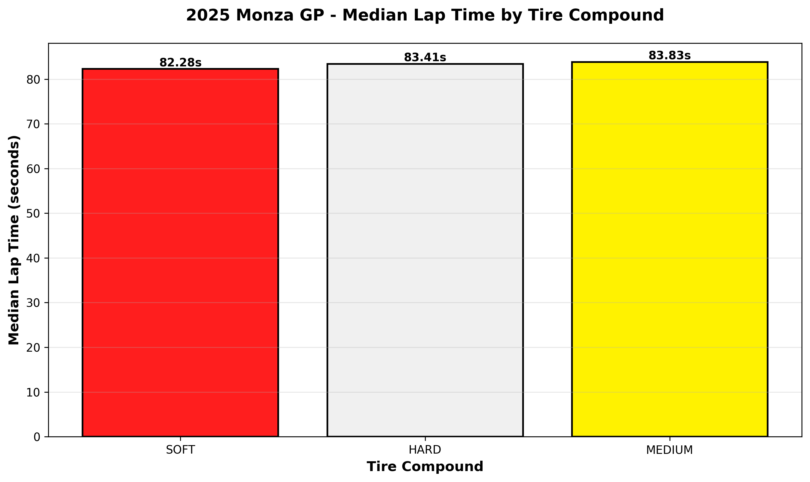
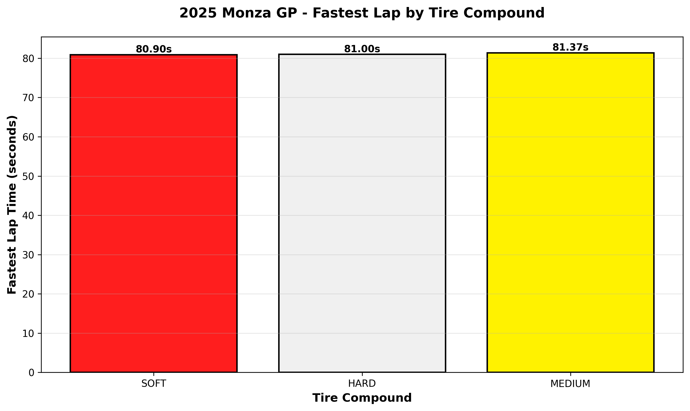
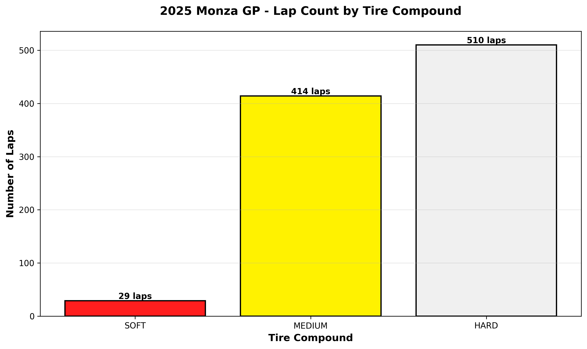

# 🏎️ F1 Lap Time Analyzer

A Python-based data analysis project that examines Formula 1 lap times to understand how tire compounds affect race performance. This project demonstrates data cleaning, manipulation, visualization, and insight generation using real F1 telemetry data.

## 🎯 Project Overview

This project analyzes the 2025 Monza Grand Prix to answer key questions:
- How do different tire compounds (SOFT, MEDIUM, HARD) perform in race conditions?
- What's the performance gap between tire compounds?
- How do teams strategize tire usage during a race?

## 📊 Key Findings - 2025 Monza GP

### Race Performance by Tire Compound

**Average Lap Times:**
- HARD: 84.02s (510 laps)
- MEDIUM: 84.06s (414 laps)
- SOFT: 86.13s (29 laps)

**Fastest Laps:**
- SOFT: 80.90s ⚡ (fastest overall!)
- HARD: 81.00s
- MEDIUM: 81.37s

### Key Insights

1. **HARD tires dominated race strategy** - Teams completed 510 laps on HARD compound vs only 29 on SOFT
2. **SOFT tires show fastest peak performance** - Minimum lap time of 80.90s, but degrades rapidly
3. **Tire degradation matters** - SOFT average (86.13s) much higher than median (82.28s), indicating severe performance drop-off with tire age
4. **Monza characteristics** - High-speed circuit with low tire wear makes HARD compound competitive for race distance

## 🛠️ Tech Stack

- **Python 3.x** - Core programming language
- **FastF1** - F1 data API for telemetry and lap times
- **Pandas** - Data manipulation and analysis
- **Matplotlib** - Data visualization
- **Jupyter Notebook** - Interactive development environment

## 📁 Project Structure
```
Lap Analyzer/
├── venv/                      # Virtual environment (isolated dependencies)
├── notebooks/                 # Jupyter notebooks with analysis
│   └── analysis.ipynb        # Main analysis notebook
├── outputs/                   # Generated charts and visualizations
│   ├── monza_tire_mean.png
│   ├── monza_tire_median.png
│   ├── monza_tire_fastest.png
│   └── monza_tire_count.png
├── cache/                     # FastF1 cached data (faster reloads)
├── .gitignore                # Git ignore file
└── README.md                 # Project documentation
```

## 🚀 Getting Started

### Prerequisites

- Python 3.8 or higher
- pip package manager
- Git

### Installation

1. **Clone the repository:**
```bash
git clone https://github.com/webdevluis0510/lap-analyzer.git
cd lap-analyzer
```

2. **Create and activate virtual environment:**
```bash
# Windows
python -m venv venv
venv\Scripts\activate

# Mac/Linux
python -m venv venv
source venv/bin/activate
```

3. **Install dependencies:**
```bash
pip install fastf1 pandas matplotlib jupyter
```

4. **Launch Jupyter Notebook:**
```bash
jupyter notebook
```

5. **Open the analysis notebook** in the `notebooks/` folder and run the cells!

## 📈 Visualizations

### Average Lap Time by Compound


### Median Lap Time by Compound


### Fastest Lap by Compound


### Lap Count by Compound


## 🧹 Data Cleaning Process

The analysis includes comprehensive data cleaning:

1. **Remove null values** - Filter out laps without valid lap times
2. **Convert time formats** - Transform timedelta objects to seconds for easier analysis
3. **Remove outliers** - Exclude laps 30+ seconds slower than fastest lap
4. **Filter pit laps** - Remove pit lane laps that don't represent racing pace

**Result:** From 1,000+ raw laps to 953 clean, analyzable laps

## 🎓 What I Learned

### Technical Skills
- **Python Environment Management** - Virtual environments, package management with pip
- **Data Cleaning** - Handling missing values, outliers, and invalid data
- **Pandas Operations** - Filtering, grouping, aggregating large datasets
- **Data Visualization** - Creating professional charts with Matplotlib
- **Git Version Control** - Tracking changes and managing project history
- **API Integration** - Working with FastF1 to access real-world F1 data

### Domain Knowledge
- **F1 Tire Strategy** - Understanding compound differences and degradation
- **Race vs Qualifying** - Different tire usage patterns in race conditions
- **Data Analysis Mindset** - Questioning results, investigating anomalies, forming hypotheses

### Key Takeaways
- Real data is messy - 80% of analysis is cleaning
- Small sample sizes can skew results (29 SOFT laps vs 510 HARD)
- Context matters - SOFT tires are fastest but rarely used in races due to degradation
- Statistical measures tell different stories (mean vs median vs min)

## 🔮 Future Improvements

- [ ] **Tire degradation analysis** - Plot lap time vs tire age to visualize performance drop-off
- [ ] **Multi-race comparison** - Compare tire performance across different circuits
- [ ] **Qualifying analysis** - Analyze Q1/Q2/Q3 to see SOFT tire dominance
- [ ] **Driver comparison** - Compare top drivers' tire management strategies
- [ ] **Weather impact** - Incorporate track temperature and conditions
- [ ] **Interactive dashboard** - Build web dashboard with Plotly/Dash
- [ ] **Automated reporting** - Generate race reports automatically

## Contributing

This is a learning project, but feedback and suggestions are welcome! Feel free to open an issue or reach out.

## License

This project is for educational purposes.

## Acknowledgments

- **FastF1** library for making F1 data accessible
- **Formula 1** for providing telemetry data
- The data analysis community for excellent learning resources

## Contact

Luis - [webdevluis0510]

Project Link: [https://github.com/webdevluis0510/f1-lap-analyzer](https://github.com/webdevluis0510/f1-lap-analyzer)

---

*Built as part of a beginner data engineering learning journey* 🚀